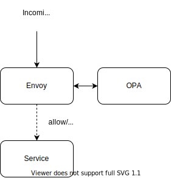

class: center, middle, inverse

# Securing Microservices with Open Policy Agent and Envoy

.right[[**Shane Soh**](https://www.linkedin.com/in/shane-soh/)]
.right[Engineering Manager, Developer Platforms]
.right[Centre for Strategic Infocomm Technologies (CSIT)]
---

# Background

### Who are we? 
**Centre for Strategic Infocomm Technologies (CSIT)** is an agency in the Ministry of Defence that builds technologies
to safeguard the national security interests of Singapore. 

Our team builds **platforms and infrastructure** that support a wide range of mission-critical operations, such as in
counter-terrorism and computer network defence.

---

# Background

### This brings about unique challenges...

* Classified *low-trust* environments where complex access control and audit logging are required for internal APIs 

* Increasingly more microservices but still have many monolithic legacy systems running on VMs

* Need API security that is easy to implement and to reason with

Thus **Open Policy Agent (OPA)** and **Envoy**

---

# What is OPA?

Open Policy Agent is a lightweight general-purpose policy engine that lets you specify **policy as code** and use APIs
to **offload policy decision-making** from your software.

.center.image-60[]

---

# What is Envoy

.center.image-40[]

Envoy is an open source edge and service proxy designed for cloud-native applications.

For our purpose, Envoy is used to delegate authorization decisions to OPA, allowing/denying requests to the service
based on OPA's policy decisions.

---

# Putting Them Together

.center[]

* Teams are expected to deploy Envoy and OPA alongside their service

* All incoming requests first go to Envoy which checks with OPA whether each request should be allowed through

* Service can simply assume any request that arrives is authorized as per OPA policies

---

# Sample Project

.footnote[[github.com/shanesoh/envoy-opa-compose](https://github.com/shanesoh/envoy-opa-compose)]

`docker-compose.yml`
```yaml
...
  app:
    image: kennethreitz/httpbin:latest

  envoy:
    build: ./compose/envoy
    ports:
      - "8080:80"
    volumes:
      - ./envoy.yaml:/config/envoy.yaml
    environment:
      - DEBUG_LEVEL=info
      - SERVICE_NAME=app  # should match name of underlying service
      - SERVICE_PORT=80
...
```

* httpbin as a mock service
* Built Envoy image does environment variable substitution for `envoy.yaml`
    * To simplify adoption as Envoy config can be rather complex

---

# Sample Project

.footnote[[github.com/shanesoh/envoy-opa-compose](https://github.com/shanesoh/envoy-opa-compose)]

`docker-compose.yml`
```yaml
...
  opa:
    image: openpolicyagent/opa:0.26.0-envoy
    volumes:
      - ./policy.rego:/config/policy.rego
    command:
      - "run"
      - "--log-level=debug"
      - "--log-format=json-pretty"
      - "--server"
      - "--set=plugins.envoy_ext_authz_grpc.path=envoy/authz/allow"
      - "--set=decision_logs.console=true"
      - "/config/policy.rego"
...
```

* OPA-Envoy image uses [opa-envoy-plugin](https://github.com/open-policy-agent/opa-envoy-plugin) which extends OPA with
  a gRPC server that implements the Envoy External Authorization (`ext_authz`) API. 

---

# Sample Project

.footnote[[github.com/shanesoh/envoy-opa-compose](https://github.com/shanesoh/envoy-opa-compose)]

`policy.rego`
```c
package envoy.authz

import input.attributes.request.http as http_request

default allow = false

allow = response {
  http_request.method == "GET"
  response := {
      "allowed": true,
      "headers": {"X-Auth-User": "1234"}
  }
}
```
* Policy decision can be boolean or an object 
* Toy policy to only allow GET requests and add additional header for `X-Auth-User`

---

# Sample Project

.footnote[[github.com/shanesoh/envoy-opa-compose](https://github.com/shanesoh/envoy-opa-compose)]

```shell
# This is allowed
$ curl -X GET http://localhost:8080/anything
{
  ...
  "headers": {
	...
    "X-Auth-User": "1234", 
	...
  }, 
  ...
  "method": "GET", 
}

# This is denied
$ curl -X POST http://localhost:8080/anything -v
...
< HTTP/1.1 403 Forbidden
...
```

---

# Sample Project

.footnote[[github.com/shanesoh/envoy-opa-compose](https://github.com/shanesoh/envoy-opa-compose)]

In our actual setup we make authorization decisions primarily using OAuth2/OIDC access tokens

```c
# ...truncated...

default allow = false

token = payload {
  # Access token in `Authorization: Bearer <token>` header
  [_, encoded] := split(http_request.headers.authorization, " ")
  [_, token, _] := io.jwt.decode(encoded)
}

allow = response {
  # Check access token contains `read` permission to `myapp`
  token.resource_access["myapp"].roles[_] == "read"

  response := {
      "allowed": true,
      "headers": {
        "X-User-Id": token.user_id,
        "X-Given-Name": token.given_name
      }
  }
}
```
---

# Use Case: Securing APIs of a headless CMS

.center.image-40[]

--

Ongoing effort to move various Excel and CSV files into a headless Content Management System (CMS), which provides

1. a UI for managing content in an underlying database
2. a set of APIs for services to interact programmatically with the database

---

# Use Case: Securing APIs of a headless CMS

Suppose APIs are as follows (as in [Directus](https://docs.directus.io/reference/api/items/#get-item-by-id))

```yaml
# Creating an article
POST /items/articles
{
  "title": "Hello world!",
  "body": "This is our first article"
}

# Querying for an article by id
GET /items/articles/15
```

However built-in access control is not flexible enough for our needs and does not support our access token definitions

---
# Use Case: Securing APIs of a headless CMS

We could write an OPA policy to secure access to those APIs

```c
# ...truncated...

# Allow querying of articles with "read" role
allow = response {
  token.resource_access["articles-service"].roles[_] == "read"
  http_request.method == "GET"
  glob.match("/items/articles/*", ["/"], http_request.path)

  response := {
      "allowed": true
  }
}

# Allow creation of articles with "write" role
allow = response {
  token.resource_access["articles-service"].roles[_] == "write"
  http_request.method == "POST"
  glob.match("/items/articles", ["/"], http_request.path)

  response := {
      "allowed": true
  }
}
```


---

# Why Do We Like OPA?

--

* Manage policy as code
    * Written in Rego
    * Declarative; relatively easy to read, write and test

--

* Decouple policy decision-making from policy enforcement
    * Authorization logic written outside of service instead of it peppered all over the code
        * Separation of concerns: Developers focus on writing application logic assuming authorization is handled
    * Policies can be reloaded without restarting underlying service

--

* Centralised management APIs
    * Policy distribution via bundles APIs
        * Especially universal policies
    * Collection of decision logs 
        * That are clearly separated from application logs

???

* Policy distribution: Perhaps ITSec can write policies as code and impose them by distributing the OPA policies
* Collection of decision logs: Useful for audit and SOC functions

---

# Why Do We Like Envoy?

* Filters to implement common functionalities
    * External Authorization (`ext_authz`) to OPA
    * But also JWT Authentication (`jwt_authn`) filter to validate access tokens

--

* Future-proofing
    * Currently east-west traffic goes through API gateway which provides functionalities like traffic control and
      logging centrally
    * Eases potential adoption of service mesh: Move functionalities into Envoy sidecars and use Istio as control plane

---
class: left, middle, inverse

# Thank you.

<i class="fas fa-envelope"></i> [soh.xr@csit.gov.sg](mailto:soh.xr@csit.gov.sg) /
<i class="fab fa-linkedin"></i> [shane-soh](https://linkedin.com/in/shane-soh) /
<i class="fab fa-github"></i> [shanesoh](https://github.com/shanesoh)

### We're Hiring! [csit.gov.sg](https://www.csit.gov.sg)
#### Software Engineer (Infrastructure) [go.gov.sg/csit-swe-infra](https://go.gov.sg/csit-swe-infra)
